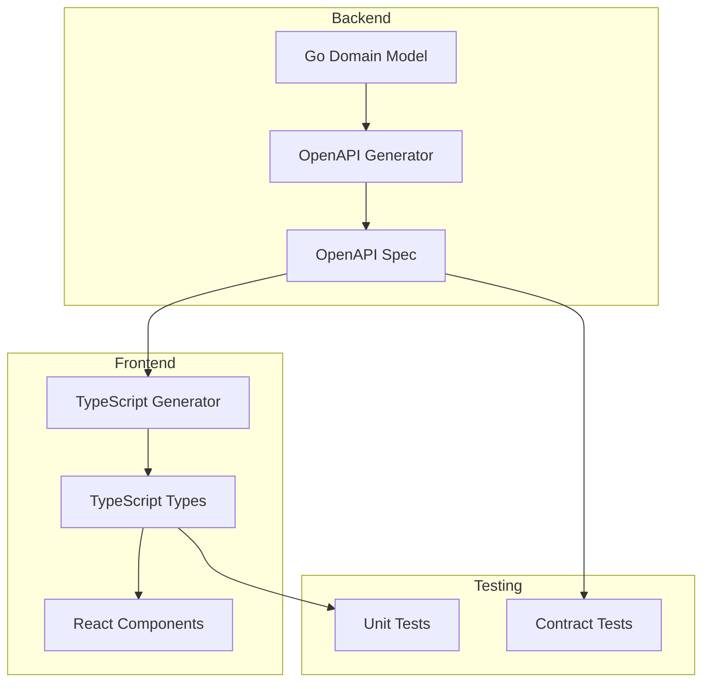

# Requirements: PaperBanana DDD+TDD Architecture

This PRD defines the requirements for establishing a unified DDD+TDD methodology across PaperBanana's full-stack architecture, ensuring domain model consistency, API contract formalization, and test-driven development practices.

## Requirement Summary

| Priority | Count | Coverage |
|----------|-------|----------|
| Must Have | 5 | Core DDD alignment, API contracts, type sync, TDD workflow |
| Should Have | 2 | Advanced testing patterns, performance contracts |
| Could Have | 1 | Automated contract testing |
| Won't Have | 1 | Legacy system migration |

## Functional Requirements

| ID | Title | Priority | Traces To |
|----|-------|----------|-----------|
| [REQ-001](REQ-001-domain-alignment.md) | Domain Model Alignment | Must | [G-001](../product-brief.md#goals--success-metrics) |
| [REQ-002](REQ-002-openapi-generation.md) | OpenAPI Specification Generation | Must | [G-003](../product-brief.md#goals--success-metrics) |
| [REQ-003](REQ-003-typescript-generation.md) | TypeScript Type Generation | Must | [G-002](../product-brief.md#goals--success-metrics) |
| [REQ-004](REQ-004-tdd-workflow.md) | TDD Workflow Definition | Must | [G-004](../product-brief.md#goals--success-metrics) |
| [REQ-005](REQ-005-domain-documentation.md) | Domain Language Documentation | Must | [G-001](../product-brief.md#goals--success-metrics) |
| [REQ-006](REQ-006-contract-testing.md) | API Contract Testing | Should | [G-003](../product-brief.md#goals--success-metrics) |
| [REQ-007](REQ-007-integration-testing.md) | Integration Testing Strategy | Should | [G-004](../product-brief.md#goals--success-metrics) |

## Non-Functional Requirements

### Performance

| ID | Title | Target |
|----|-------|--------|
| [NFR-P-001](NFR-P-001-typegen-performance.md) | Type Generation Performance | < 10 seconds for full regeneration |

### Usability

| ID | Title | Target |
|----|-------|--------|
| [NFR-U-001](NFR-U-001-developer-experience.md) | Developer Onboarding | < 30 minutes to understand domain model |

## Data Requirements

### Data Entities

| Entity | Description | Key Attributes |
|--------|-------------|----------------|
| Project | Top-level organizational unit | id, name, description, created_at, updated_at |
| Folder | Nested organization within project | id, project_id, parent_id, name, created_at |
| Visualization | Chart/diagram entry | id, project_id, folder_id, name, current_version_id |
| VisualizationVersion | Immutable snapshot | id, visualization_id, version_number, session_id |
| SessionRecord | Persisted session state | id, project_id, status, current_stage, snapshot |
| Artifact | Generated file metadata | id, kind, mime_type, storage_key, byte_size |

### Data Flows

## Integration Requirements

| System | Direction | Protocol | Data Format | Notes |
|--------|-----------|----------|-------------|-------|
| Go Backend | Outbound | Code gen | OpenAPI 3.0 | swaggo annotations |
| TypeScript Frontend | Inbound | Code gen | TypeScript | openapi-typescript |
| CI/CD | Both | CLI | JSON/YAML | Automated regeneration |

## Constraints & Assumptions

### Constraints
- Must maintain backward compatibility with existing API endpoints
- Type generation must be deterministic and repeatable
- DDD boundaries must respect existing Clean Architecture

### Assumptions
- Team will adopt OpenAPI annotations in Go code
- Frontend can accommodate generated type naming conventions
- CI/CD pipeline can accommodate new generation steps

## Priority Rationale

**Must Have**: Core foundation - without these, the unified architecture cannot exist.
**Should Have**: Important for quality assurance but can be added incrementally.
**Could Have**: Nice to have for advanced use cases, can be deferred.
**Won't Have**: Explicitly out of scope to avoid scope creep.

## Traceability Matrix

| Goal | Requirements |
|------|-------------|
| G-001 | REQ-001, REQ-005 |
| G-002 | REQ-003 |
| G-003 | REQ-002, REQ-006 |
| G-004 | REQ-004, REQ-007 |
| G-005 | REQ-005, NFR-U-001 |

## Open Questions

- [ ] Which OpenAPI generator version to standardize on?
- [ ] How to handle versioning of generated types?
- [ ] What's the rollback strategy if generation fails?

## References

- Derived from: [Product Brief](../product-brief.md)
- Next: [Architecture](../architecture/_index.md)
